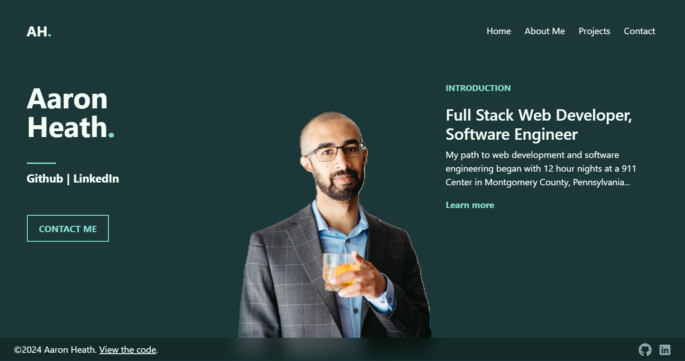

## Overview
Welcome! This protfolio showcases my skills, projects, and expereinces as a software developer. It serves as a central hub where visitors can learn more about me, explore my projects, and get in touch. The application is built using ReactJS. You can access it [here](https://aaronheath.netlify.app).

## Features
*   **Responsive Design:** The portfolio is designed to be responsive on various devices and screensizes.
*   **Project Showcase:** Explore my projects with descriptions, images, and links to live demos or repositories.
*   **About Me:** Learn more about me, my background, skills, and interests.
*   **Contact Form:** Reach out to me directly using the contact form provided on the website.

## Technologies Used
*   **React.js:** The frontend of the portfolio is built using React.js.
*   **Netlify:** The portfolio is deployed using Netlify for easy access and hosting.

## Installation
To run the portfolio locally:
1.  Clone the repository to your local machine.
2.  Navigate to the project directory
3.  Install dependencies using `npm install`
4.  Start the development serves with `npm run dev`.
5.  Open the portfolio in your web browser at the appropriate url (likely `http://localhost:3000`)

## Credits

N/A
